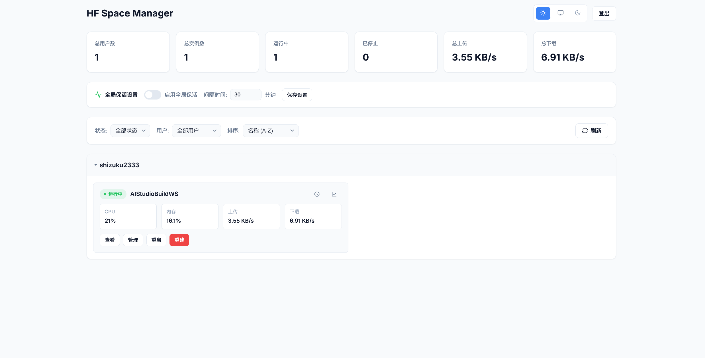

# HF Space Manager

HuggingFace Spaces 监控与管理面板。实时查看实例状态、资源占用，支持一键重启/重建、定时重启和保活功能。



## 功能

- 📊 **实时监控** - CPU、内存、网络流量实时图表
- 🔄 **实例管理** - 重启、重建操作
- ⏰ **定时重启** - 按小时间隔自动重启
- 💓 **保活功能** - 防止 Space 休眠（全局/单独配置）
- 👥 **多用户支持** - 同时监控多个 HF 账户
- 🔐 **权限控制** - 未登录仅可查看，登录后可操作
- 🌓 **主题切换** - 浅色/深色/跟随系统
- 📡 **外部 API** - RESTful 接口供第三方调用

## 快速开始

### Docker（推荐）

```bash
docker run -d -p 8080:8080 \
  -e HF_USER="username:hf_token" \
  -e USER_NAME="admin" \
  -e USER_PASSWORD="your_password" \
  -v ./data:/app/data \
  --name hf-manager \
  ghcr.io/shizuku-yume/hf-space-manager:latest
```

### Docker Compose

```yaml
services:
  hf-manager:
    image: ghcr.io/shizuku-yume/hf-space-manager:latest
    ports:
      - "8080:8080"
    environment:
      - HF_USER=user1:token1,user2:token2
      - USER_NAME=admin
      - USER_PASSWORD=your_password
    volumes:
      - ./data:/app/data
    restart: unless-stopped
```

### 手动部署

```bash
git clone https://github.com/Shizuku-Yume/hf-space-manager.git
cd hf-space-manager
npm install
HF_USER="username:token" npm start
```

## 环境变量

| 变量 | 说明 | 默认值 |
|------|------|--------|
| `HF_USER` | HF用户和Token，格式 `user:token`，多个用逗号分隔 | *必填* |
| `USER_NAME` | 登录用户名 | `admin` |
| `USER_PASSWORD` | 登录密码 | `password` |
| `API_KEY` | 外部API密钥 | - |
| `PORT` | 端口 | `8080` |
| `SHOW_PRIVATE` | 未登录时显示私有实例 | `false` |
| `LOG_LEVEL` | 日志级别 (`error`/`warn`/`info`/`debug`) | `info` |
| `DATA_DIR` | 数据存储目录 | `./data` |
| `RATE_LIMIT_MAX` | 每IP每分钟请求限制 | `100` |

## API

### 内部接口

| 端点 | 方法 | 说明 |
|------|------|------|
| `/health` | GET | 健康检查 |
| `/api/proxy/spaces` | GET | 获取实例列表 |
| `/api/proxy/restart/:repoId` | POST | 重启实例 |
| `/api/proxy/rebuild/:repoId` | POST | 重建实例 |
| `/api/schedule/restart/:repoId` | GET/POST | 定时重启配置 |
| `/api/keepalive/:repoId` | GET/POST | 单实例保活配置 |
| `/api/keepalive-global` | GET/POST | 全局保活配置 |

### 外部接口

需要 `Authorization: Bearer <API_KEY>` 认证。

| 端点 | 方法 | 说明 |
|------|------|------|
| `/api/v1/info/:token` | GET | 获取用户实例列表 |
| `/api/v1/info/:token/:spaceId` | GET | 获取实例详情 |
| `/api/v1/action/:token/:spaceId/restart` | POST | 重启 |
| `/api/v1/action/:token/:spaceId/rebuild` | POST | 重建 |

## 健康检查

```bash
curl http://localhost:8080/health
```

```json
{
  "status": "healthy",
  "uptime": 3600,
  "memory": { "heapUsed": "45MB", "rss": "80MB" },
  "cache": { "spacesCount": 10 },
  "scheduledTasks": { "restarts": 2, "keepAlives": 3 }
}
```

## License

MIT
